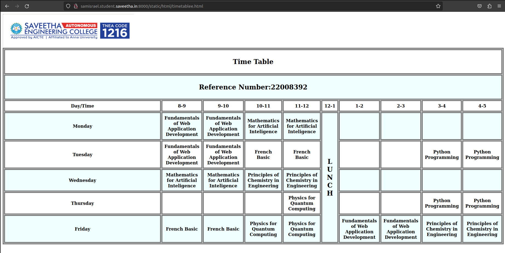
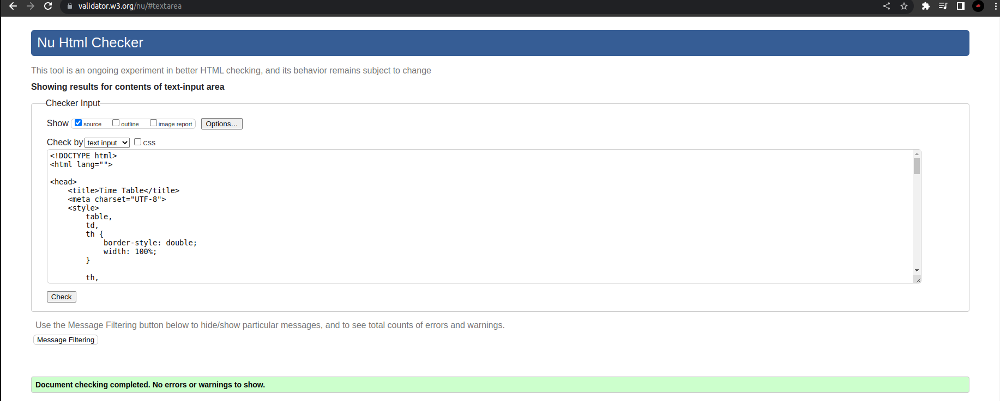

# Experiment_Time_Table

## AIM
To Write a html webpage page to display your timetable.

# ALGORITHM
### STEP 1
create a simple table using table tag
### STEP 2
Add header row using th tag
### STEP 3
Add your timetable
### STEP 4
Execute the program

# CODE

```html
<!DOCTYPE html>
<html lang="">

<head>
    <title>Time Table</title>
    <meta charset="UTF-8">
    <style>
        table,
        td,
        th {
            border-style: double;
            width: 100%;
        }

        th,
        td {
            text-align: center;
            padding: 8px;
        }

        tr:nth-child(even) {
            background-color: azure;
        }
    </style>
</head>

<body>
    
    <table>
        <tr>
            <td colspan="10">
                <h2>Time Table</h2>
            </td>
        </tr>
        <tr>
            <td colspan="10">
                <h2>Reference Number:22008392</h2>
            </td>
        </tr>
        <tr>
            <th>Day/Time</th>
            <th>8-9</th>
            <th>9-10</th>
            <th>10-11</th>
            <th>11-12</th>
            <th>12-1</th>
            <th>1-2</th>
            <th>2-3</th>
            <th>3-4</th>
            <th>4-5</th>
        </tr>
        <tr>
            <th><b></b>Monday</b></th>
            <th>Fundamentals of Web Application Development</th>
            <th>Fundamentals of Web Application Development</th>
            <th>Mathematics for Artificial Inteligence</th>
            <th>Mathematics for Artificial Inteligence</th>
            <td rowspan="5">
                <h2>L<br>U<br>N<br>C<br>H</h2>
            </td>
            <th></th>
            <th></th>
            <th></th>
            <th></th>
        </tr>
        <tr>
            <th>Tuesday</th>
            <th>Fundamentals of Web Application Development</th>
            <th>Fundamentals of Web Application Development</th>
            <th>French Basic</th>
            <th>French Basic</th>
            <th></th>
            <th></th>
            <th>Python Programming</th>
            <th>Python Programming</th>
        </tr>
        <tr>
            <th>Wednesday</th>
            <th>Mathematics for Artificial Inteligence</th>
            <th>Mathematics for Artificial Inteligence</th>
            <th>Principles of Chemistry in Engineering</th>
            <th>Principles of Chemistry in Engineering</th>
            <th></th>
            <th></th>
            <th></th>
            <th></th>
        </tr>
        <tr>
            <th>Thursday</th>
            <th></th>
            <th></th>
            <th></th>
            <th>Physics for Quantum Computing</th>
            <th></th>
            <th></th>
            <th>Python Programming</th>
            <th>Python Programming</th>
        </tr>
        <tr>
            <th>Friday</th>
            <th>French Basic</th>
            <th>French Basic</th>
            <th>Physics for Quantum Computing</th>
            <th>Physics for Quantum Computing</th>
            <th>Fundamentals of Web Application Development</th>
            <th>Fundamentals of Web Application Development</th>
            <th>Principles of Chemistry in Engineering</th>
            <th>Principles of Chemistry in Engineering</th>
        </tr>
    </table>
</body>

</html>
```
<br>
<br>
<br>


# OUPUT

